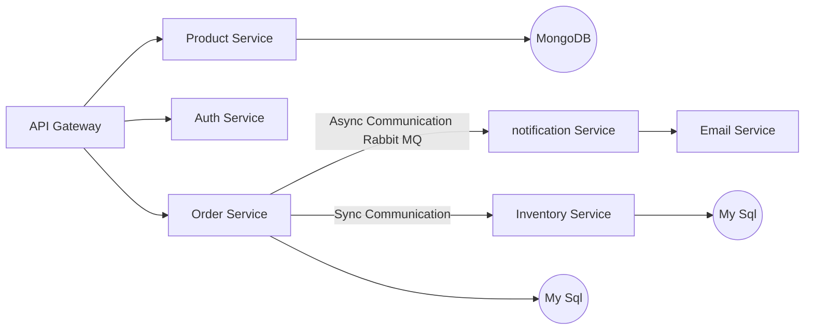

```mermaid
graph LR
GATEWAY[API Gateway] -->PRODUCT_SERVICE[Product Service]
GATEWAY[API Gateway] -->AUTH[Auth Service]
GATEWAY[API Gateway] -->ORDER_SERVICE[Order Service]
    PRODUCT_SERVICE --> MONGODB((MongoDB))
    ORDER_SERVICE -->|Async Communication Rabbit MQ| NOTIFICATION_SERVICE[notification Service]
    ORDER_SERVICE -->|Sync Communication| INVENTORY_SERVICE[Inventory Service]
    ORDER_SERVICE --> MYSQL1((My Sql))
    INVENTORY_SERVICE --> MYSQL2((My Sql))
    NOTIFICATION_SERVICE --> EMAIL[Email Service]
```
