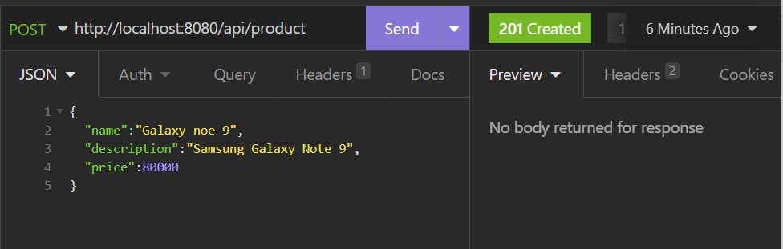
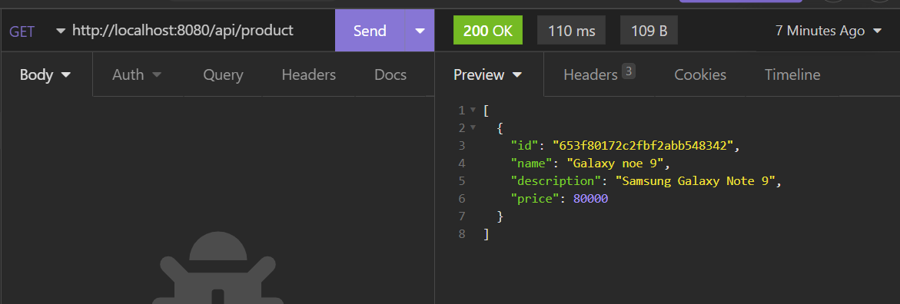
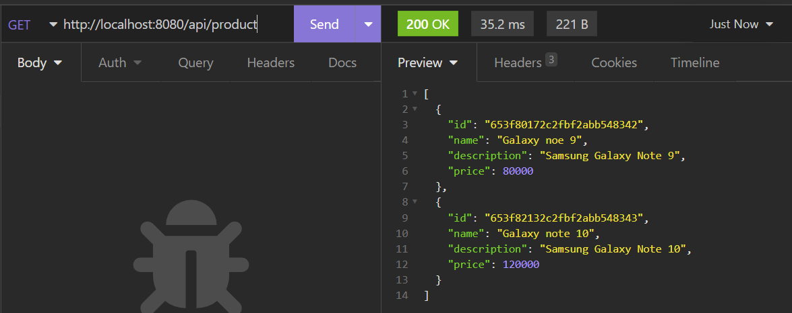

# Run latest mongoDB
```bash
docker pull mongodb/mongodb-community-server
docker run --name mongo -p 27017:27017 -d mongodb/mongodb-community-server:latest
```

## Inspect mongoDB

```bash
docker inspect mongo
```


## POST add product 



{
"name":"Galaxy note 10",
"description":"Samsung Galaxy Note 10",
"price":120000
}

## GET products



